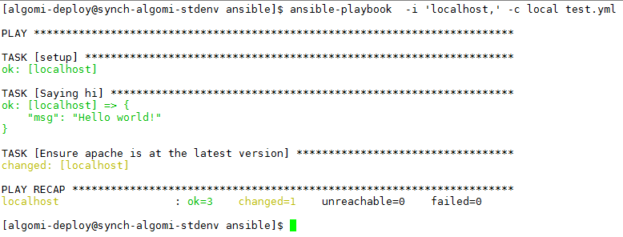

# ansible-human_log

This Ansible v2.x callback plugin generates human-readable result logging in the Ansible log file.

- Forked from: https://github.com/n0ts/ansible-human_log

- Inspired from: https://github.com/redhat-openstack/khaleesi/blob/master/plugins/callbacks/human_log.py

- Original from:

    - https://gist.github.com/cliffano/9868180
    - http://blog.cliffano.com/2014/04/06/human-readable-ansible-playbook-log-output-using-callback-plugin/

Requirements
------------
This callback has not been tested on any version of Ansible other than v2.0.1.0. It requires Ansible >=v2.x.

Dependencies
------------
none.

Example Usage
-------------

Assuming the following folder structure is in place:

    .
    ├── ansible.cfg
    ├── callback_plugins
    │   └── human_log.py
    └── test.yml
    

**File: ansible.cfg**

    [defaults]
    log_path = ./ansible.log
    callback_plugins = ./callback_plugins/

**File: test.yml**

    ---
    - hosts: all
      become: yes
      tasks:
      - name: Saying hi
        debug: msg="Hello world!"
      - name: Ensure apache is at the latest version
        yum: name=httpd state=latest
      - name: Display all variables/facts known for a host
        debug: var=hostvars[inventory_hostname]
    ...

If you run ansible-playbook, as a user who has sudo rights, in the folder containing the ansible.cfg + test.yml files + callback_plugins sub folder, as follows:

`ansible-playbook  -i 'localhost,' -c local test.yml`

You should see the following output on screen:

...and should see the creation of an ansible.log file which contains the following content:

    2016-04-08 12:24:45,192 p=1987 u=algomi-deploy |  PLAY ***************************************************************************
    2016-04-08 12:24:45,206 p=1987 u=algomi-deploy |  TASK [setup] *******************************************************************
    2016-04-08 12:24:45,600 p=1987 u=algomi-deploy |  ok: [localhost]
    2016-04-08 12:24:45,604 p=1987 u=algomi-deploy |  TASK [Saying hi] ***************************************************************
    2016-04-08 12:24:45,617 p=1987 u=algomi-deploy |  ok: [localhost] => {
        "msg": "Hello world!"
    }
    2016-04-08 12:24:45,618 p=1987 u=algomi-deploy |  msg:
    Hello world!
    2016-04-08 12:24:45,619 p=1987 u=algomi-deploy |  TASK [Ensure apache is at the latest version] **********************************
    2016-04-08 12:24:48,805 p=1987 u=algomi-deploy |  changed: [localhost]
    2016-04-08 12:24:48,805 p=1987 u=algomi-deploy |  results:
    Loaded plugins: fastestmirror
    Setting up Install Process
    Loading mirror speeds from cached hostfile
     * base: repo.bigstepcloud.com
     * epel: vesta.informatik.rwth-aachen.de
     * extras: mirror.simwood.com
     * updates: centos.serverspace.co.uk
    Resolving Dependencies
    --> Running transaction check
    ---> Package httpd.x86_64 0:2.2.15-47.el6.centos.4 will be installed
    --> Finished Dependency Resolution
    
    Dependencies Resolved
    
    ================================================================================
     Package      Arch          Version                        Repository      Size
    ================================================================================
    Installing:
     httpd        x86_64        2.2.15-47.el6.centos.4         updates        831 k
    
    Transaction Summary
    ================================================================================
    Install       1 Package(s)
    
    Total download size: 831 k
    Installed size: 2.9 M
    Downloading Packages:
    Running rpm_check_debug
    Running Transaction Test
    Transaction Test Succeeded
    Running Transaction
    ^M  Installing : httpd-2.2.15-47.el6.centos.4.x86_64                          1/1
    ^M  Verifying  : httpd-2.2.15-47.el6.centos.4.x86_64                          1/1
    
    Installed:
      httpd.x86_64 0:2.2.15-47.el6.centos.4
    
    Complete!
    
    2016-04-08 12:24:48,806 p=1987 u=algomi-deploy |  PLAY RECAP *********************************************************************
    2016-04-08 12:24:48,806 p=1987 u=algomi-deploy |  localhost                  : ok=3    changed=1    unreachable=0    failed=0
    

